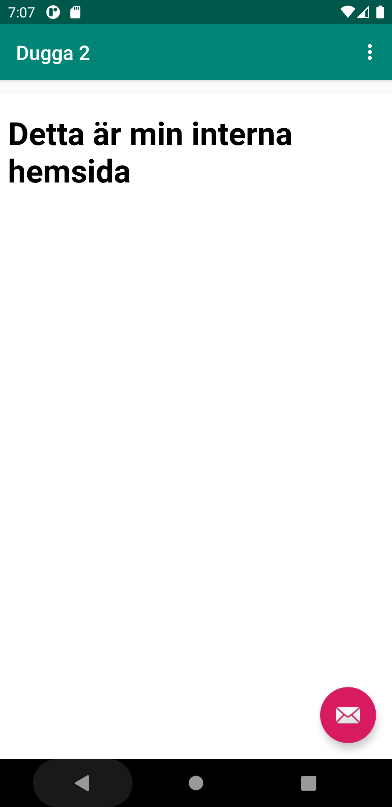

# Assignment 2

För att ändra namnet på min applikation så ändrade jag i filen strings.XML. Här finns en det taggar,
vara en av dem heter "app_name". Här ändrades namnet genom attskriva detnya namnet mellan taggarna.
```
<string name="app_name">Dugga 2</string>
``` 
Därefter so gav jag applikationen "internt acces" i filen AndroidManifest.xml. Detta görs med hjälp
av en users-permission tagg engligt nedan.
```
<uses-permission android:name="android.permission.INTERNET" />
```
Sedan skapades ett Webview element i mitt conten_main.xml fil. Här byttes den xisterande "TextView"
ut mot "WebView". Här gav även min WebView ett ID som är: "my_webview".

```
<WebView
        android:id="@+id/my_webview"
        android:layout_width="match_parent"
        android:layout_height="match_parent"
        android:layout_marginTop="70dp"
        app:layout_constraintBottom_toBottomOf="parent"
        app:layout_constraintTop_toTopOf="parent"
        tools:layout_editor_absoluteX="0dp" />
```

Därefter så deklareras en private member variabel som är av datatypen webview. 
```
  WebView myWebView;
```
Därefter så instatierar jag variabeln i min on Create() för att kunna hitta min vy med hjälp av ID't
my_webview. Det som ligger i on create sker bara en gång när man startar applikationen. 
```
    myWebView = findViewById(R.id.my_webview);
```

Sedan aktiverade jag så att min applikationkananvänds sig utav javascript. 
```
   WebSettings webSettings = myWebView.getSettings();
   webSettings.setJavaScriptEnabled(true);
```

Sedan skapades en asset mapp där jag lade in en HTML hemsida som ska vara applikationens interna 
hemsida. 

```
    <!DOCTYPE html>
    <html lang="en">
    <head>
        <meta charset="UTF-8">
        <meta http-equiv="X-UA-Compatible" content="IE=edge">
        <meta name="viewport" content="width=device-width, initial-scale=1.0">
        <title>Document</title>
    
    </head>
    <body>
    <h1>Detta är min interna hemsida</h1>
    </body>
    </html>
```

Därefter lade jag in två olika URL:er i två olika funktioner där den ena ska läsa in den interna 
hemsidan som jag skapat medans den andra ska öpnna en externa hemsida som jag har hämtat ifrån 
internet. Här används min webview variabel för att ladda en hemsida med hjälp av"loadURL()". Den URL
som ska laddas lades in i parantesen. 

```
 public void showExternalWebPage(){
       
   
        myWebView.loadUrl("https://www.youtube.com/");

    }
```
```
 public void showInternalWebPage(){

        
        myWebView.loadUrl("file:///android_asset/internhemsida.html");

    }
```

Det sista som görs är att jag kallar på dessa funktioner i en if statement som säger att om man 
klickar på kappen för extern hemsida, så visa extern hemsida. Samma sak gäller för knappen för intern
hemsida, och då visas i stället den. 


```
        if (id == R.id.action_external_web) {
            showExternalWebPage();
            return true;
        }

        if (id == R.id.action_internal_web) {
            showInternalWebPage();
            return true;
        }
    
```





